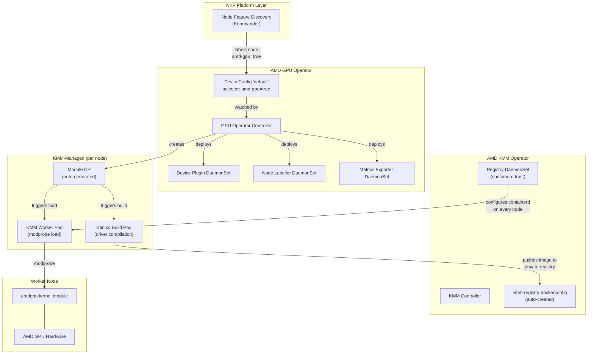
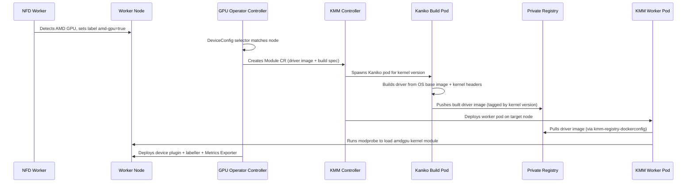
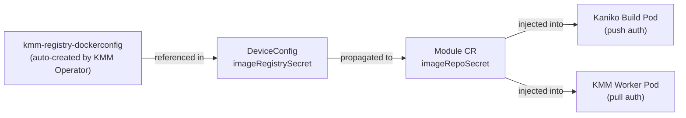

# AMD GPU Operator

NKP catalog component for the [AMD GPU Operator](https://github.com/ROCm/gpu-operator).

## Architecture



### Driver Build Flow



## Dependencies

| Dependency | Purpose | Enforcement |
|---|---|---|
| `amd-kmm-operator` | Shared KMM instance + registry plumbing | `metadata.yaml` (`dependencies`) -- strongly recommended, not required |
| Node Feature Discovery | GPU hardware detection and labelling | Provided by Kommander platform layer |

## Default Configuration

The following subcharts are **disabled** by default because they are provided by other NKP components:

| Subchart | Disabled | Provided By |
|---|---|---|
| `kmm` | `kmm.enabled: false` | `amd-kmm-operator` |
| `node-feature-discovery` | `node-feature-discovery.enabled: false` | Kommander |

The chart auto-creates a `DeviceConfig` CR named `default` with:
- `spec.selector: { feature.node.kubernetes.io/amd-gpu: "true" }` (physical GPUs)
- `spec.driver.enable: true`
- Built-in device plugin, Node Labeller, and Metrics Exporter

## NFD Toleration Requirement

Kommander's NFD worker DaemonSet must include the following toleration to discover AMD GPUs on tainted nodes:

```yaml
tolerations:
  - key: "amd-dcm"
    operator: "Equal"
    value: "up"
    effect: "NoExecute"
```

Without this, NFD workers won't run on nodes with the `amd-dcm` taint, and those nodes won't receive AMD GPU feature labels.

## Node Feature Labels

The GPU Operator installs NFD rules that produce two labels. Each requires its own `DeviceConfig` CR:

| NFD Label | Meaning | Default CR |
|---|---|---|
| `feature.node.kubernetes.io/amd-gpu: "true"` | Physical GPU (PF) detected | `default` (auto-created) |
| `feature.node.kubernetes.io/amd-vgpu: "true"` | Virtual GPU (SR-IOV VF) detected | User must create a second `DeviceConfig` |

## Config Overrides (Private Registry)

When enabling this operator with a private registry, supply config overrides that align with the `kmm-registry-credentials` secret created for the AMD KMM Operator. Replace the registry host, port, and project with your values:

```yaml
deviceConfig:
  spec:
    driver:
      enable: true
      image: "<registry-host>:<port>/<project>/amdgpu_kmod"
      imageBuild:
        baseImageRegistry: "<registry-host>:<port>/<project>"
        baseImageRegistryTLS:
          insecure: false
          insecureSkipTLSVerify: false
      imageRegistrySecret:
        name: "kmm-registry-dockerconfig"
      imageRegistryTLS:
        insecure: false
        insecureSkipTLSVerify: false
```

### Override Fields

| Field | Description |
|---|---|
| `driver.image` | Registry path where built GPU driver images are pushed/pulled. Do not include a tag; the operator manages tags automatically. |
| `driver.imageRegistrySecret.name` | Must be `kmm-registry-dockerconfig`, auto-created by the AMD KMM Operator reconciler. |
| `driver.imageBuild.baseImageRegistry` | Private mirror hosting OS base images (e.g. `ubuntu:24.04`) for Kaniko builds. Avoids Docker Hub rate limits. |
| `driver.imageRegistryTLS.insecure` | Set `true` for plain HTTP registries. |
| `driver.imageRegistryTLS.insecureSkipTLSVerify` | Set `true` for self-signed certificates. |

### Credential Flow



## Install / Uninstall

**Install:** It is strongly recommended to enable `amd-kmm-operator` first, then `amd-gpu-operator`. Without a KMM instance, driver builds will not function.

**Uninstall:** Disable `amd-gpu-operator` first, then `amd-kmm-operator`.
