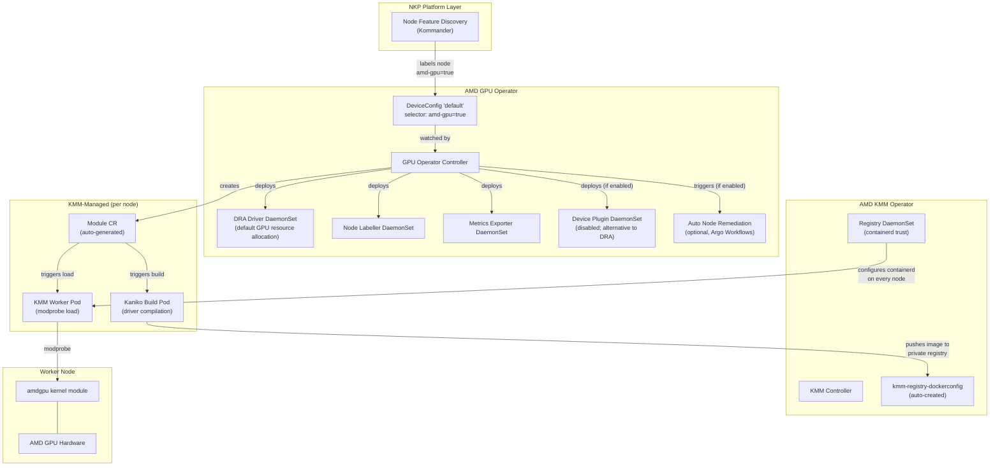
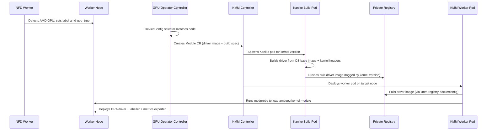
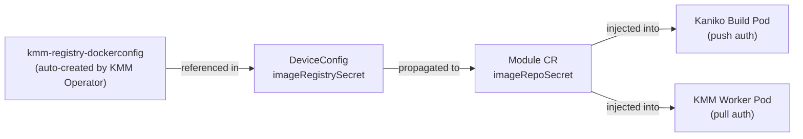

# AMD GPU Operator

NKP catalog component for the [AMD GPU Operator](https://github.com/ROCm/gpu-operator) v1.5.1.

> **Note:** v1.5.1 is a maintenance release built on the v1.5.0 feature set. It bumps the
> operator controller, utils, and device metrics exporter images to `v1.5.1`, and the DRA driver
> to `v1.0.1`. DRA driver `v1.0.1` is required with amdgpu driver `6.19.14` / release `31.40`
> and later. The device plugin (`1.31.0.10`), KMM (`v1.0.0`), and NFD (`v0.18.3`) components are unchanged.

## Architecture



### Driver Build Flow



## Dependencies

| Dependency | Purpose | Enforcement |
|---|---|---|
| `amd-kmm-operator` | Shared KMM instance + registry plumbing | `metadata.yaml` (`dependencies`) -- strongly recommended, not required |
| Node Feature Discovery | GPU hardware detection and labelling | Provided by Kommander platform layer |
| Argo Workflows v4.0.3 | Auto Node Remediation (optional) | Installed by chart when `remediation.enabled: true` |

## Default Configuration

The following subcharts are **disabled** by default because they are provided by other NKP components:

| Subchart | Disabled | Provided By |
|---|---|---|
| `kmm` | `kmm.enabled: false` | `amd-kmm-operator` |
| `node-feature-discovery` | `node-feature-discovery.enabled: false` | Kommander |
| `remediation` | `remediation.enabled: false` | Requires Argo Workflows — opt-in |

The chart auto-creates a `DeviceConfig` CR named `default` with:
- `spec.selector: { feature.node.kubernetes.io/amd-gpu: "true" }` (physical GPUs)
- `spec.driver.enable: true`
- DRA driver (default), node labeller, and metrics exporter
- Device Plugin disabled (mutually exclusive with DRA)

## Grafana Dashboards

The bundled overview, GPU, job, and node dashboards are sourced from the
[ROCm device-metrics-exporter Grafana dashboards](https://github.com/ROCm/device-metrics-exporter/tree/main/grafana).
They use NKP's local `prometheus` datasource and filter metrics by GPU and
node labels.

## Metrics Exporter Configuration

The metrics exporter configuration is vendored from the upstream
[GPU configuration example](https://github.com/ROCm/device-metrics-exporter/blob/main/example/config-gpu.json)
at `helmrelease/metrics-exporter-config/config.json`. It enables GPU labels,
including `GPU_UUID`, uses unprefixed metric names, and omits the upstream
static `CLUSTER_NAME` label so NKP Thanos provides cluster attribution.
Review the upstream example when updating the exporter.

### Staged Operator and Driver Upgrades

Application upgrades preserve the existing `DeviceConfig/default` because
the staged override retains the baseline driver value. The catalog default is
`crds.defaultCR.upgrade: true`; use the following sequence to separate the
controller rollout from the kernel-driver transition:

1. Upgrade the application from v1.5.0 to v1.5.1 with
   `crds.defaultCR.upgrade: true` and
   `deviceConfig.spec.driver.version: "31.30"`. Disable DRA and Metrics Exporter,
   then wait for the target controller to become Ready and verify that the
   DeviceConfig, loaded driver, and GPU-node boot IDs remain unchanged.
2. In a separate reconciliation, restore
   `deviceConfig.spec.driver.version: "31.40"` (the stable driver release)
   while keeping DRA and Metrics Exporter disabled. Keep
   `upgradePolicy.enable: true` and `rebootRequired: true` so the operator
   performs the managed, serial driver upgrade and deliberately reboots each
   selected GPU node.

The target driver phase is complete only after every selected GPU node has a
new boot ID, is Ready, and reports `Upgrade-Complete`. Verify the target module,
then restore DRA and Metrics Exporter and verify their pods, ResourceSlices,
and a DRA workload after recovery.
Setting `upgradePolicy.enable: false` is not an equivalent gate: it disables
managed upgrade orchestration rather than preventing KMM Module reconciliation.

## Pinned Image Versions

| Component | Image | Tag |
|---|---|---|
| GPU Operator Controller | `docker.io/rocm/gpu-operator` | `v1.5.1` |
| GPU Operator Utils | `docker.io/rocm/gpu-operator-utils` | `v1.5.1` |
| Device Metrics Exporter | `docker.io/rocm/device-metrics-exporter` | `v1.5.1` |
| DRA Driver | `docker.io/rocm/k8s-gpu-dra-driver` | `v1.0.1` |
| Device Plugin | `docker.io/rocm/k8s-device-plugin` | `1.31.0.10` |
| Node Labeller | `docker.io/rocm/k8s-device-plugin` | `labeller-1.31.0.10` |
| KMM (shared) | `docker.io/rocm/kernel-module-management-operator` | `v1.0.0` |
| NFD (platform) | `registry.k8s.io/nfd/node-feature-discovery` | `v0.18.3` |

## v1.5.0 Feature Set (carried forward)

| Feature | Status | Notes |
|---|---|---|
| DRA Driver | **Enabled by default** | Replaces Device Plugin for GPU resource allocation; DRA is GA on K8s 1.35+ (NKP v2.18.0+), CDI in containerd 2.1+ |
| Auto Node Remediation (ANR) | Disabled by default | Argo Workflows-based GPU node recovery |
| Node Problem Detector (NPD) | Integration available | Requires separate NPD installation |
| `kmm.watch` parameter | Set to `true` | Independent control over KMM usage vs. installation |
| Global image pull secrets | Available | `global.imagePullSecrets` or `commonConfig.imageRegistrySecrets` |
| Custom package repos | Available | `imageBuild.packageRepoURL` / `gpgKeyURL` |
| New metrics | Active | `GPU_PROCESS_CU_OCCUPANCY`, `GPU_ECC_DEFERRED_*` |
| NFD subchart | v0.18.3 | Disabled in NKP (provided by Kommander) |

## NFD Toleration Requirement

Kommander's NFD worker DaemonSet must include the following toleration to discover AMD GPUs on tainted nodes:

```yaml
tolerations:
  - key: "amd-dcm"
    operator: "Equal"
    value: "up"
    effect: "NoExecute"
```

Without this, NFD workers won't run on nodes with the `amd-dcm` taint, and those nodes won't receive AMD GPU feature labels.

## Node Feature Labels

The GPU Operator installs NFD rules that produce two labels. Each requires its own `DeviceConfig` CR:

| NFD Label | Meaning | Default CR |
|---|---|---|
| `feature.node.kubernetes.io/amd-gpu: "true"` | Physical GPU (PF) detected | `default` (auto-created) |
| `feature.node.kubernetes.io/amd-vgpu: "true"` | Virtual GPU (SR-IOV VF) detected | User must create a second `DeviceConfig` |

## Config Overrides (Private Registry)

When enabling this operator with a private registry, supply config overrides that align with the `kmm-registry-credentials` secret created for the AMD KMM Operator. Replace the registry host, port, and project with your values:

```yaml
deviceConfig:
  spec:
    driver:
      enable: true
      blacklist: true
      version: "31.40"
      image: "<registry-host>:<port>/<project>/amdgpu_kmod"
      imageBuild:
        baseImageRegistry: "<registry-host>:<port>/<project>"
        baseImageRegistryTLS:
          insecure: false
          insecureSkipTLSVerify: false
        packageRepoURL: ""   # optional: override repo.radeon.com for air-gapped environments
        gpgKeyURL: ""         # optional: override GPG key URL for air-gapped environments
      imageRegistrySecret:
        name: "kmm-registry-dockerconfig"
      imageRegistryTLS:
        insecure: false
        insecureSkipTLSVerify: false
    commonConfig:
      imageRegistrySecrets:
        - name: "kmm-registry-dockerconfig"   # injected into all operator-managed workloads
    draDriver:
      enable: true
      image: "docker.io/rocm/k8s-gpu-dra-driver:v1.0.1"
    devicePlugin:
      enableDevicePlugin: false
```

### Override Fields

| Field | Description |
|---|---|
| `driver.blacklist` | When `true`, unloads the in-tree `amdgpu` kernel module before loading the DKMS version. Required on nodes with a built-in `amdgpu` driver (most Ubuntu kernels). |
| `driver.version` | The amdgpu DKMS driver version to build (e.g. `30.30.3` for ROCm 7.2.1). See the [compatibility matrix](https://rocm.docs.amd.com/projects/install-on-linux/en/latest/reference/user-kernel-space-compat-matrix.html). |
| `driver.image` | Registry path where built GPU driver images are pushed/pulled. Do not include a tag; the operator manages tags automatically. |
| `driver.imageRegistrySecret.name` | Must be `kmm-registry-dockerconfig`, auto-created by the AMD KMM Operator reconciler. |
| `driver.imageBuild.baseImageRegistry` | Private mirror hosting OS base images (e.g. `ubuntu:24.04`) for Kaniko builds. Avoids Docker Hub rate limits. |
| `driver.imageBuild.packageRepoURL` | Override `repo.radeon.com` for air-gapped environments. |
| `driver.imageBuild.gpgKeyURL` | Override GPG key URL for air-gapped environments. |
| `driver.imageRegistryTLS.insecure` | Set `true` for plain HTTP registries. |
| `driver.imageRegistryTLS.insecureSkipTLSVerify` | Set `true` for self-signed certificates. |
| `commonConfig.imageRegistrySecrets` | Global pull secrets injected into all operator-managed workloads (DRA driver, metrics exporter, labeller, build pods, etc.). |
| `draDriver.enable` | Enables the DRA driver (default: `true`). Mutually exclusive with `devicePlugin.enableDevicePlugin`. |
| `draDriver.image` | DRA driver image. Override for private registry environments. |
| `devicePlugin.enableDevicePlugin` | Enables the traditional Device Plugin (default: `false`). Set `true` and `draDriver.enable: false` to revert to the legacy approach. |

### Credential Flow



## Install / Uninstall

**Install:** It is strongly recommended to enable `amd-kmm-operator` first, then `amd-gpu-operator`. Without a KMM instance, driver builds will not function.

**Uninstall:** Disable `amd-gpu-operator` first, then `amd-kmm-operator`.
