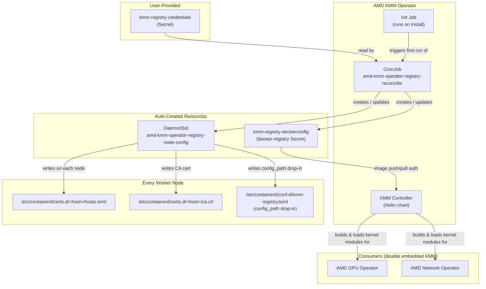
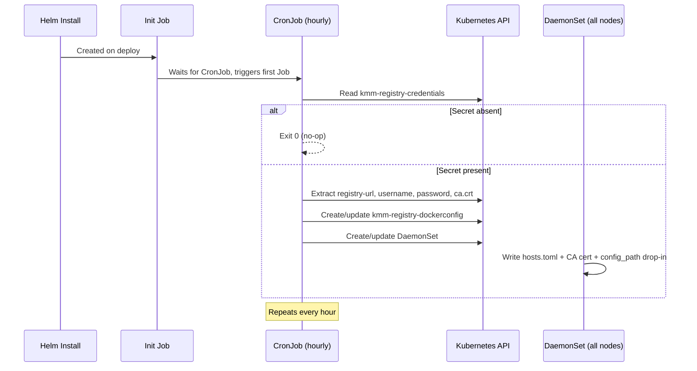

# AMD KMM Operator

Shared Kernel Module Management (KMM) operator for AMD GPU and Network operators. Provides a standalone KMM instance, private registry credential plumbing, and node containerd trust configuration.

## Architecture



### Reconciliation Flow



## Prerequisites

If using a private registry for driver image builds, create the credentials secret before or after installing. The reconciler picks it up on the next run.

```bash
kubectl create secret generic kmm-registry-credentials \
  --namespace=<workspace-namespace> \
  --from-literal=registry-url=https://<registry-host>:<port>/<project> \
  --from-literal=username=<user> \
  --from-literal=password='<password>' \
  --from-file=ca.crt=/path/to/ca.crt    # optional; omit if registry uses a public CA
```

### Secret Keys

| Key | Required | Description |
|---|---|---|
| `registry-url` | Yes | Full URL including scheme, e.g. `https://registry.example.com:5000/project`. May include a project path. |
| `username` | Yes | Registry username |
| `password` | Yes | Registry password |
| `ca.crt` | No | PEM-encoded CA certificate for TLS trust. Omit if the registry uses a publicly trusted CA. |

If the secret is absent, KMM is still installed and functional — registry plumbing is simply not created.

## Install / Uninstall Order

**Install:** `amd-kmm-operator` first, then `amd-gpu-operator` and/or `amd-network-operator`.

**Uninstall:** Consumers first (`amd-gpu-operator`, `amd-network-operator`), then `amd-kmm-operator`.

## Config Overrides for GPU / Network Operators

The GPU and Network operators must be configured to push and pull driver images from the same private registry. When enabling either operator, supply config overrides that reference the registry host and the `kmm-registry-dockerconfig` secret created by this operator's reconciler. See the respective operator README files for the full override YAML.

## What the Reconciler Creates

| Resource | Name | Purpose |
|---|---|---|
| Secret (docker-registry) | `kmm-registry-dockerconfig` | Pull/push auth for KMM image operations |
| DaemonSet | `amd-kmm-operator-registry-node-config` | Configures containerd on every node to trust the private registry |

Both resources are owned by the CronJob (via `ownerReferences`) and are garbage-collected when the operator is uninstalled.

### Node Configuration (DaemonSet)

On each node, the DaemonSet writes:

1. **`/etc/containerd/conf.d/kmm-registry.toml`** — drop-in that sets `config_path = "/etc/containerd/certs.d"` so containerd reads per-registry config.
2. **`/etc/containerd/certs.d/<host>/hosts.toml`** — registry endpoint configuration with pull/resolve/push capabilities.
3. **`/etc/containerd/certs.d/<host>/ca.crt`** — CA certificate (only if `ca.crt` was provided in the credentials secret).

Cleanup is handled by a `preStop` hook that removes these files when the DaemonSet is deleted.

## CRD Lifecycle

KMM CRDs are installed with `crds: CreateReplace` and are **preserved** on uninstall by default (Helm does not delete CRDs). This prevents data loss if consumers still have `Module` or `NodeModulesConfig` resources.

## Self-Healing Reconciliation

The registry reconciler CronJob runs on install (via an init Job) and hourly thereafter. It is fully idempotent:
- If `kmm-registry-credentials` appears after initial install, the plumbing is created automatically.
- If the credentials secret is updated, the dockerconfig and DaemonSet are reconciled on the next cycle.
- If resources are accidentally deleted, they are recreated.
