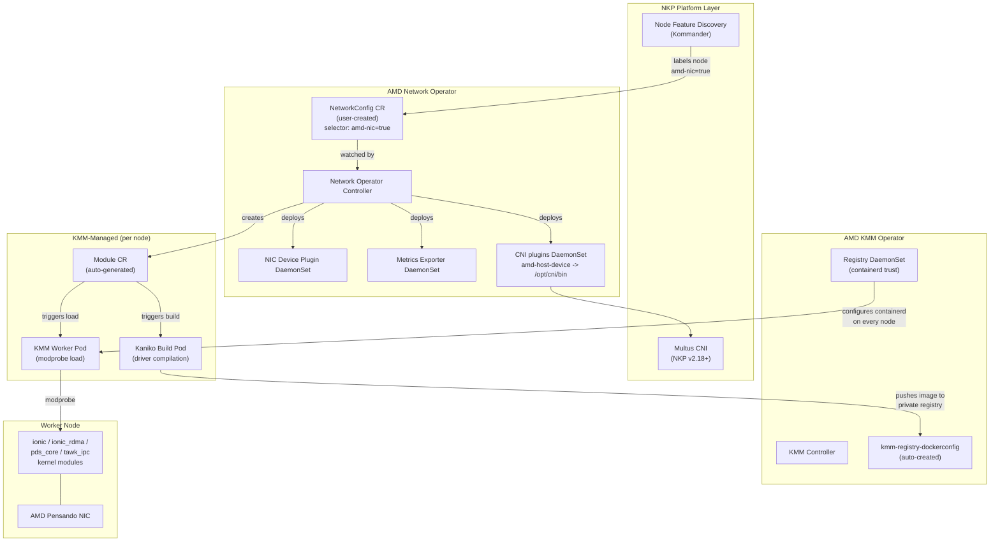
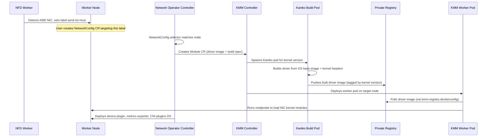
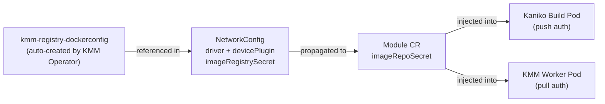

# AMD Network Operator (catalog 1.2.0) — internal notes

**Source of truth for product docs, user workflow, and the `NetworkConfig` example is [`metadata.yaml`](metadata.yaml)** (`overview:`). Edit that file first. This README must not carry a second copy of the CR; it only adds packaging, architecture, and lab details for catalog maintainers.

Customer-facing content in `metadata.yaml` includes:

- Application description, workflow, and `NetworkConfig` example (`name: network`, firmware `1.117.5-a-77`, device plugin `v1.2.0`, `secondaryNetwork.cniPlugins`).
- Field notes (`blacklist`, `upgradePolicy`, nicctl/firmware pairing, exporter `:5001`, CNI plugins).
- Workload NAD + `amd.com/nic` example.

If those drift, the NKP UI is wrong even if this README looks current.

## Catalog layout

| Path | Role |
| --- | --- |
| `metadata.yaml` | NKP UI overview and the canonical `NetworkConfig`. |
| `helmrelease/` | HelmRelease + values ConfigMap (`cm.yaml`). Controller chart only; it does **not** create a `NetworkConfig`. |
| `helmrelease/metrics-exporter-config/` | ConfigMap name referenced as `${releaseName}-${appVersion}-metrics-exporter-config`. |
| `grafana-dashboards/` | AINIC system/job dashboards. |
| `licenses.yaml` | License set; CNI plugins are in-scope once `secondaryNetwork.cniPlugins.enable: true`. |
| `../../../../scripts/cirrascale-amd-network-operator-config-overrides.yaml` | CirraScale lab overlay (private registry, firmware `1.117.5-a-77`). Do not copy lab IPs or `10.216.61.81:5000` into `metadata.yaml`. |

## Architecture



### Driver build flow



### Credential flow



`secondaryNetwork.cniPlugins` uses the public image `docker.io/rocm/k8s-cni-plugins:v1.2.0`. Do **not** attach `kmm-registry-dockerconfig` to that block.

## Difference from GPU Operator

The Network Operator **does not** auto-create a `NetworkConfig` from Helm values. Users apply the CR from `metadata.yaml` after enabling the app. The GPU Operator auto-creates `DeviceConfig/default`. **Never** name the `NetworkConfig` `default`; both controllers derive child names from the CR name and will collide.

## Dependencies and subcharts

| Dependency | Purpose | Enforcement |
|---|---|---|
| `amd-kmm-operator` | Shared KMM + `kmm-registry-dockerconfig` | `metadata.yaml` `dependencies` (recommended, not `requiredDependencies`) |
| Node Feature Discovery | `amd-nic` / `amd-vnic` labels | Kommander; chart NFD subchart stays off |
| Multus | `NetworkAttachmentDefinition` | NKP v2.18+; `multus.enabled: false` in this chart |

| Subchart | Default | Provided by |
|---|---|---|
| `kmm` | `kmm.enabled: false` | `amd-kmm-operator` |
| `node-feature-discovery` | disabled | Kommander |
| `multus` | disabled | NKP v2.18+ |

Embedded KMM (`kmm.enabled: true`) is an escape hatch: skip the catalog KMM app and create `kmm-registry-dockerconfig` yourself. NKP v2.17 and earlier need `multus.enabled: true` in Helm overrides.

## NFD on tainted GPU nodes

Kommander's NFD worker must tolerate:

```yaml
tolerations:
  - key: "amd-dcm"
    operator: "Equal"
    value: "up"
    effect: "NoExecute"
```

Without that, tainted GPU nodes never get `feature.node.kubernetes.io/amd-nic=true`, and the `NetworkConfig` selector matches nothing.

## Firmware and nicctl (lab)

Canonical pairing in `metadata.yaml` is firmware **`1.117.5-a-77`** with Hub `k8s-network-device-plugin:v1.2.0` (nicctl for `1.117.5-a-56` / `1.117.5-a-77` only).

If a card is still on **`1.117.1-a-63`**, do not use that Hub plugin tag: it CrashLoopBackOffs with empty `lif`. Override `devicePlugin.devicePluginImage` with a private image whose bundled nicctl matches the card. Matrix: https://github.com/ROCm/k8s-network-device-plugin#compatibility-matrix

`driver.version` must match firmware (`dmesg` or `nicctl show version firmware`).

## CNI plugins vs Test 1 static PF

`secondaryNetwork.cniPlugins.enable: true` installs `amd-host-device` into `/opt/cni/bin`. Missing this yields `failed to find plugin "amd-host-device"`.

`amd.com/nic: 1` plus `amd-host-device` injects RDMA device nodes but **does not** pick the same PF on two nodes. Isolated Test 0 `/24` rails then cannot peer. CirraScale Test 1 therefore used standard `host-device` + explicit `TEST_RAIL` and a privileged `/dev/infiniband` hostPath so `ibv_open_device` works. That is a lab workaround, not catalog default. Document it in `network-operator-tests/test-1/`, not in `metadata.yaml`.

## Install / uninstall

Enable `amd-kmm-operator`, then `amd-network-operator`, then apply the `NetworkConfig` from `metadata.yaml`. Uninstall in reverse: delete the CR, disable network operator, then KMM.

## Helm overrides

Controller image, resources, and tolerations are Helm values (`helmrelease/cm.yaml`). The `NetworkConfig` is **not** a Helm value. Full chart knobs: [values.yaml](https://github.com/ROCm/network-operator/blob/v1.2.0/helm-charts-k8s/values.yaml).
