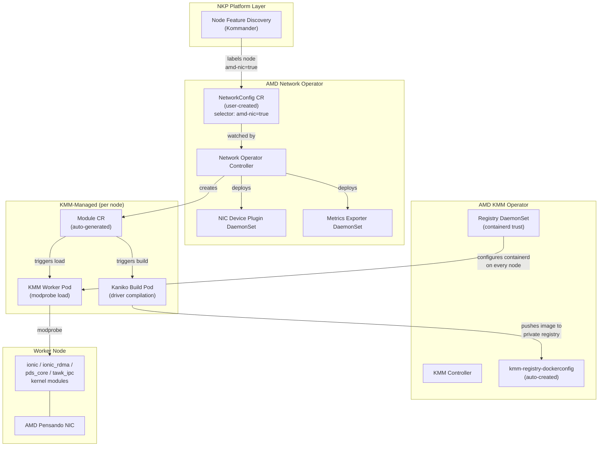
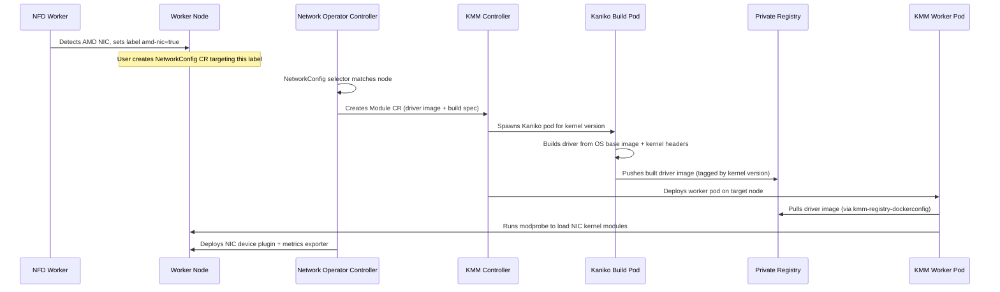
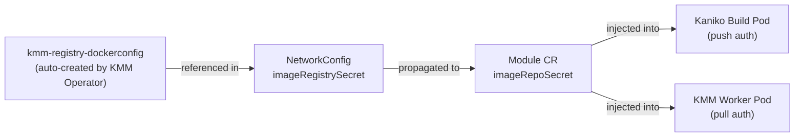

# AMD Network Operator

NKP catalog component for the [AMD Network Operator](https://github.com/ROCm/network-operator).

## Architecture



### Driver Build Flow



## Key Difference from GPU Operator

The Network Operator **does not** auto-create a `NetworkConfig` CR from Helm values. Users must manually create one after enabling the operator. This is different from the GPU Operator, which auto-creates a `DeviceConfig` named `default`.

> **Important:** Choose a `NetworkConfig` name other than `default` to avoid conflicts with the GPU Operator's `DeviceConfig`, since both CRD controllers use the name to generate a shared Dockerfile ConfigMap.

## Dependencies

| Dependency | Purpose | Enforcement |
|---|---|---|
| `amd-kmm-operator` | Shared KMM instance + registry plumbing | `metadata.yaml` (`dependencies`) -- strongly recommended, not required |
| Node Feature Discovery | NIC hardware detection and labelling | Provided by Kommander platform layer |

## Default Configuration

The following subcharts are **disabled** by default because they are provided by other NKP components:

| Subchart | Disabled | Provided By |
|---|---|---|
| `kmm` | `kmm.enabled: false` | `amd-kmm-operator` |
| `node-feature-discovery` | `node-feature-discovery.enabled: false` | Kommander |
| `multus` | `multus.enabled: false` | NKP v2.18+ |

## NFD Toleration Requirement

Kommander's NFD worker DaemonSet must include the following toleration to discover AMD NICs on tainted nodes:

```yaml
tolerations:
  - key: "amd-dcm"
    operator: "Equal"
    value: "up"
    effect: "NoExecute"
```

Without this, NFD workers won't run on nodes with the `amd-dcm` taint, and those nodes won't receive AMD NIC feature labels.

## Node Feature Labels

The operator (via the GPU Operator's NFD rules) produces two NIC labels. Each requires its own `NetworkConfig` CR:

| NFD Label | Meaning |
|---|---|
| `feature.node.kubernetes.io/amd-nic: "true"` | Physical NIC (PF) — Pensando DSC Ethernet Controller |
| `feature.node.kubernetes.io/amd-vnic: "true"` | Virtual NIC (SR-IOV VF) — Pensando DSC Ethernet Controller VF |

## NetworkConfig CR (Private Registry)

After enabling the operator, create a `NetworkConfig` CR that aligns with the `kmm-registry-credentials` secret created for the AMD KMM Operator:

```yaml
apiVersion: amd.com/v1alpha1
kind: NetworkConfig
metadata:
  name: network              # must NOT be "default" — see note above
  namespace: <workspace-namespace>
spec:
  selector:
    feature.node.kubernetes.io/amd-nic: "true"
  driver:
    enable: true
    image: "<registry-host>:<port>/<project>/amdnetwork_kmod"
    imageBuild:
      baseImageRegistry: "<registry-host>:<port>/<project>"
      baseImageRegistryTLS:
        insecure: false
        insecureSkipTLSVerify: false
    imageRegistrySecret:
      name: "kmm-registry-dockerconfig"
    imageRegistryTLS:
      insecure: false
      insecureSkipTLSVerify: false
```

### Override Fields

| Field | Description |
|---|---|
| `driver.image` | Registry path where built NIC driver images are pushed/pulled. Do not include a tag; the operator manages tags automatically. |
| `driver.imageRegistrySecret.name` | Must be `kmm-registry-dockerconfig`, auto-created by the AMD KMM Operator reconciler. |
| `driver.imageBuild.baseImageRegistry` | Private mirror hosting OS base images (e.g. `ubuntu:24.04`) for Kaniko builds. Avoids Docker Hub rate limits. |
| `driver.imageRegistryTLS.insecure` | Set `true` for plain HTTP registries. |
| `driver.imageRegistryTLS.insecureSkipTLSVerify` | Set `true` for self-signed certificates. |

### Credential Flow



## Install / Uninstall

**Install:** It is strongly recommended to enable `amd-kmm-operator` first, then `amd-network-operator`. Without a KMM instance, driver builds will not function.

**Uninstall:** Disable `amd-network-operator` first, then `amd-kmm-operator`.
