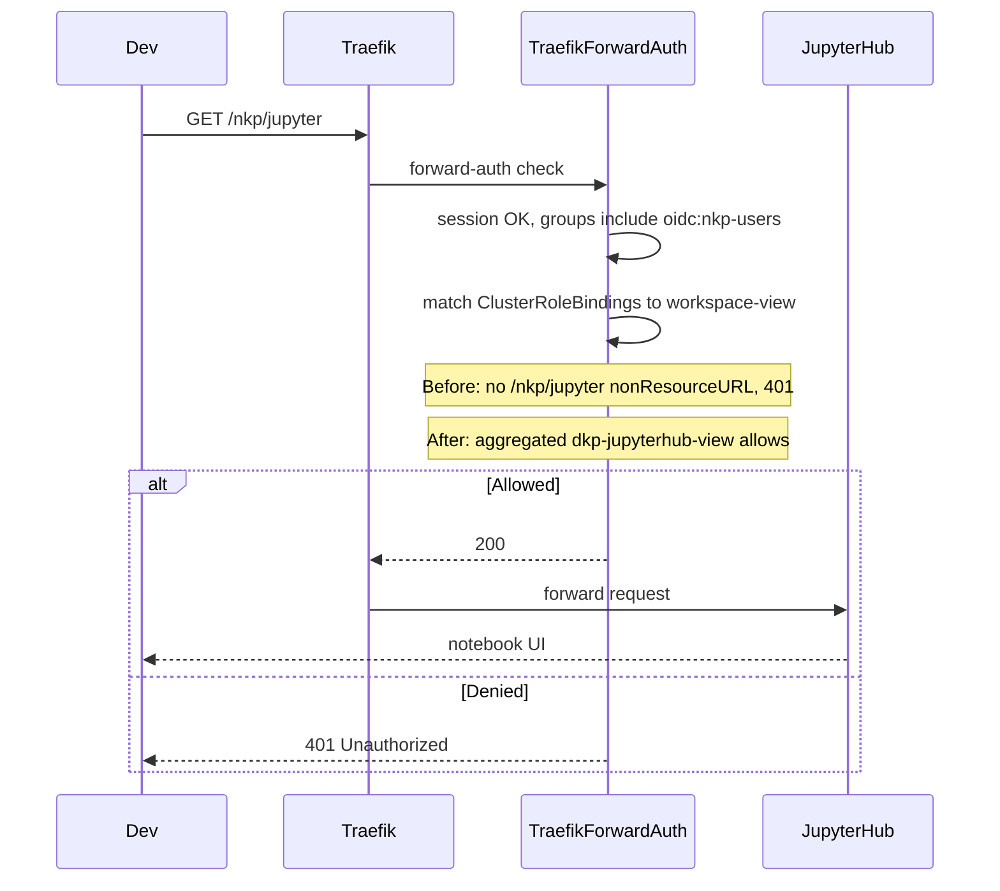
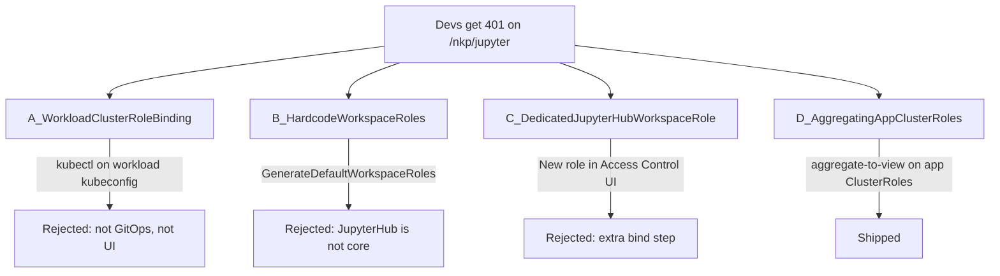
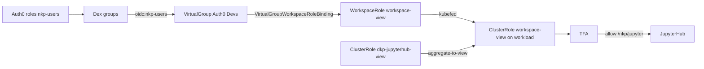
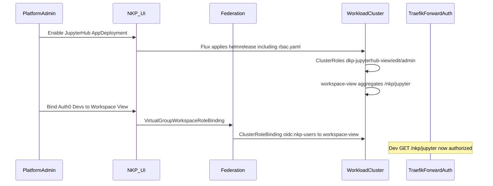

# JupyterHub access for non-admin NKP users

This document explains why workspace users without `cluster-admin` were blocked from
JupyterHub, the one-off workaround that unblocked them, the native NKP options we
considered, and the approach this catalog entry now ships.

## Table of contents

- [The problem](#the-problem)
- [The hacky solution](#the-hacky-solution)
- [Approaches we considered](#approaches-we-considered)
- [What we shipped and why](#what-we-shipped-and-why)
- [Implementation](#implementation)
- [How to grant access in the NKP UI](#how-to-grant-access-in-the-nkp-ui)
- [What this does not change](#what-this-does-not-change)

## The problem

JupyterHub is a **workspace catalog app**, not an NKP core platform application.
Enabling it in a workspace already did three things correctly:

1. Deployed the Hub with Ingress at `/nkp/jupyter`.
2. Put Traefik Forward Auth (TFA) in front of that Ingress (NKP SSO via Dex).
3. Published a dashboard ConfigMap so the cluster **Application Dashboards** tab
   shows a JupyterHub launch tile (`jupyterhub-ui-dashboard-cm.yaml`).

It did **not** tell TFA that Workspace View users are allowed to hit that path.

TFA is the authorization gate for browser traffic. After SSO, it evaluates
Kubernetes `ClusterRole` / `ClusterRoleBinding` objects on **that cluster** and
matches the request URL against `nonResourceURLs`. Grafana and Traefik work for
non-admins because their apps (or default WorkspaceRoles) ship those URL rules
with `aggregate-to-view` labels. JupyterHub did not.

So the identity pipeline could be correct (Auth0 → Dex groups → `oidc:nkp-users`)
and the tile could still appear, but a Dev received **Unauthorized** from TFA
before JupyterHub ever ran. `cluster-admin` worked because that role implicitly
covers all non-resource URLs.



Two layers are easy to confuse:

| Layer | Question it answers | Owner |
| --- | --- | --- |
| TFA `nonResourceURLs` | May this identity load `/nkp/jupyter` at all? | NKP / this catalog app |
| JupyterHub username + PVC | Which notebook server and volume does this user get? | JupyterHub (`X-Forwarded-User`) |
| JupyterHub `admin_users` | May this user use the Hub admin panel? | JupyterHub Helm values |

Per-user PVCs were never the bug. Hub already keys servers off the Dex/TFA user.
The bug was TFA refusing the path for anyone not bound to a role that included
those URLs.

## The hacky solution

The workaround was to extract the workload kubeconfig and apply a dedicated
ClusterRole plus ClusterRoleBinding on the **workload cluster**:

```yaml
apiVersion: rbac.authorization.k8s.io/v1
kind: ClusterRole
metadata:
  name: jupyterhub-ui-access
rules:
  - nonResourceURLs:
      - /jupyter
      - /jupyter/*
      - /dkp/jupyter
      - /dkp/jupyter/*
      - /nkp/jupyter
      - /nkp/jupyter/*
    verbs: [get, post, put, patch, delete]
---
apiVersion: rbac.authorization.k8s.io/v1
kind: ClusterRoleBinding
metadata:
  name: auth0-devs-jupyter-access
roleRef:
  apiGroup: rbac.authorization.k8s.io
  kind: ClusterRole
  name: jupyterhub-ui-access
subjects:
  - kind: Group
    name: oidc:nkp-users
    apiGroup: rbac.authorization.k8s.io
```

That works, and it is the wrong product shape:

- Access is granted with `kubectl` against the workload cluster, not the NKP UI.
- The binding is a one-off for one IdP group on one cluster.
- It does not appear as a Workspace Role in Access Control.
- Disabling the JupyterHub AppDeployment does not remove the RBAC.
- It duplicates path aliases (`/jupyter`, `/dkp/jupyter`) the Ingress does not
  serve.

## Approaches we considered



### A. One-off ClusterRoleBinding on the workload cluster

The hack above. Fast to demo, invisible to the catalog and to Access Control.

### B. Hardcode default WorkspaceRoles in Kommander

Add `generateDashboardJupyterHub*Role` to `GenerateDefaultWorkspaceRoles()` in
Kommander (`workspace_types.go`), the same way Traefik / Grafana / Prometheus
dashboards are always present.

Rejected: JupyterHub is a **catalog** app enabled per workspace. Default
WorkspaceRoles exist on every workspace whether the app is installed or not.
That is the right pattern for always-on platform dashboards, not an optional AI
catalog entry. It would also require a Kommander core change for a catalog app.

### C. Dedicated JupyterHub WorkspaceRole in the Access Control UI

Create a `WorkspaceRole` (UI: "Cluster Role") with `/nkp/jupyter` rules and bind
Auth0 Devs to that role explicitly.

This is NKP-native and visible in the UI, but:

- Operators must bind a new role in addition to Workspace View.
- The role would live in Kommander (generated defaults) or be created by hand
  per workspace. The app bundle cannot create management-cluster `WorkspaceRole`
  CRs.
- We wanted Devs who already have Workspace View to get JupyterHub
  automatically when the app is enabled.

### D. App-shipped aggregating ClusterRoles (grafana-logging pattern)

Ship `dkp-jupyterhub-view|edit|admin` ClusterRoles **in the JupyterHub catalog
entry**, labeled:

- `rbac.authorization.k8s.io/aggregate-to-view: "true"`
- `rbac.authorization.k8s.io/aggregate-to-edit: "true"`
- `rbac.authorization.k8s.io/aggregate-to-admin: "true"`

Do **not** add a ClusterRoleBinding. `workspace-view` / `workspace-edit` /
`workspace-admin` already aggregate those labels. When the app is enabled, the
roles appear on member clusters and Kubernetes aggregation folds `/nkp/jupyter`
into Workspace View. When the app is removed, Flux prunes the ClusterRoles and
the extra URLs disappear.

This is how optional workspace apps such as grafana-logging grant dashboard
access without becoming core platform roles.

## What we shipped and why

**Approach D.**

Goals:

- JupyterHub stays a workspace catalog app (no Kommander `workspace_types.go`
  change).
- Operators grant access in the NKP UI by binding the Dev group to **Workspace
  View** (a role that already exists).
- Enabling the app is what turns JupyterHub access on; disabling it turns it
  off.
- Devs can **use** notebooks (spawn/stop), not only load the HTML.



Why not C as well: a dedicated JupyterHub role in Access Control would still be
useful for "View the workspace but not JupyterHub." That was explicitly out of
scope. Workspace View is the grant.

## Implementation

### Files

| File | Change |
| --- | --- |
| `4.3.2/helmrelease/rbac.yaml` | Three aggregating ClusterRoles |
| `4.3.2/helmrelease/kustomization.yaml` | Include `rbac.yaml` |

No ClusterRoleBinding is shipped. Aggregation is the binding.

### ClusterRoles

Paths match the Ingress (`hub.baseUrl: /nkp/jupyter`). We do not advertise
`/jupyter` or `/dkp/jupyter`; those prefixes are not served.

JupyterHub is not a read-only dashboard. Spawn and stop use POST and DELETE.
`dkp-jupyterhub-view` therefore includes `get`, `head`, `post`, `put`, `patch`,
and `delete`. A GET-only view role would let TFA load the page and then fail
when the user starts a server.

| ClusterRole | Aggregation label | Verbs |
| --- | --- | --- |
| `dkp-jupyterhub-view` | `aggregate-to-view` | get, head, post, put, patch, delete |
| `dkp-jupyterhub-edit` | `aggregate-to-edit` | same as view |
| `dkp-jupyterhub-admin` | `aggregate-to-admin` | `*` |

TFA URL RBAC is coarse (path-level). Isolation of one user's notebook from
another remains JupyterHub's job (username from `X-Forwarded-User`, per-user
pod and PVC). Hub admin panel access remains `hub.config.Authenticator.admin_users`.

### Runtime flow after the change



## How to grant access in the NKP UI

No new JupyterHub role is created.

1. **Identity Providers → Groups**: map the IdP group (for Auth0 roles, for
   example `oidc:nkp-users`) to an NKP Group such as "Auth0 Devs".
2. **Access Control** on the workspace: bind that group to **Workspace View**
   (the default `workspace-view` Cluster Role).
3. Enable JupyterHub on the workspace (or wait for Flux to reconcile after this
   catalog version is installed).

Admins continue to use Workspace Admin / cluster-admin. Do not add Dev emails
to JupyterHub `admin_users` unless they should manage other users' servers.

After deploy, confirm on a member cluster:

```bash
kubectl get clusterrole dkp-jupyterhub-view,dkp-jupyterhub-edit,dkp-jupyterhub-admin
kubectl get clusterrole -l kubefed.io/managed=true | grep workspace-view
# The aggregated workspace-view ClusterRole should list /nkp/jupyter
```

Log in as a Dev (Workspace View only), open the JupyterHub tile or
`/nkp/jupyter/`. A personal notebook should start. Uninstall JupyterHub and the
`dkp-jupyterhub-*` ClusterRoles should disappear; Workspace View otherwise
stays the same.

## What this does not change

- **Auth0 / Dex claim mapping.** If Dex does not receive groups, TFA never sees
  `oidc:nkp-users`. That is an identity-provider Connector issue (`claimMapping.groups`),
  not JupyterHub RBAC.
- **Per-user PVCs.** Still created by KubeSpawner per authenticated username.
- **Kommander core default WorkspaceRoles.** JupyterHub remains catalog-scoped.
- **JupyterHub `admin_users`.** Path access ≠ Hub administrator.

## Scalable profile mapping for admin and dev groups

The RBAC work in this document solves **access to `/nkp/jupyter`** via Workspace
View. It does not define which JupyterHub spawn profile a user can pick.

If you need two or more profiles by group (for example `oidc:nkp-admins`,
`oidc:nkp-users`, and future groups), there are two viable designs.

### Design A: keep ForwardAuth + RemoteUser, derive groups from headers

This is the least disruptive option for the current catalog setup. The JupyterHub
ingress already uses Traefik ForwardAuth and forwards identity headers. In Kommander,
the `forwardauth` middleware can pass `Impersonate-Group` headers in addition to
`X-Forwarded-User`.

**How it works**

1. TFA authenticates with Dex and authorizes URL access.
2. TFA forwards identity headers to JupyterHub.
3. A custom JupyterHub authenticator reads `X-Forwarded-User` plus group headers.
4. `auth_state` stores groups for the user.
5. A `profile_list` callable filters profiles by group membership.

**Pros**

- Reuses current architecture, no Dex client changes for JupyterHub.
- Fastest path from hardcoded emails to scalable groups.

**Cons**

- More custom Python logic to maintain.
- Depends on header contracts between Traefik/TFA and Hub.

### Design B: direct OIDC in JupyterHub (recommended long-term)

This aligns with upstream JupyterHub/OAuthenticator group semantics.

**How it works**

1. JupyterHub authenticates users directly against Dex OIDC endpoints.
2. Dex returns group claims (`nkp-admins`, `nkp-users`, etc.).
3. OAuthenticator maps those claims into JupyterHub groups.
4. `profile_list` callable filters profiles by those groups.

**Pros**

- Native group-aware auth flow.
- Cleaner separation and easier to scale to many groups.

**Cons**

- Requires OIDC client settings and migration off current `remoteuser` default.
- Must avoid accidental dual-gate redirect loops during migration.

### Chosen sequence

For this catalog, a pragmatic rollout is:

1. Keep current TFA + RemoteUser for access control.
2. Implement Design A to remove hardcoded `admin_users` dependence for profiles.
3. Later migrate to Design B when you want full direct OIDC ownership in Hub.

This minimizes disruption while making profile assignment scalable now.

Status: step 2 is implemented in `4.3.2/helmrelease/cm.yaml` as the default
behavior for this catalog entry.

## Example: group-based profile selection (Design A)

Use Workspace Configuration overrides to add an extra config block that:

- parses group headers into `auth_state`,
- marks hub-admin from groups (not by fixed emails), and
- filters spawn profiles by group.

```yaml
hub:
  extraConfig:
    20-group-aware-remoteuser.py: |
      from jupyterhub.handlers import BaseHandler
      from jupyterhub.auth import Authenticator
      from tornado import web
      from traitlets import Unicode

      def _parse_groups(values):
          groups = []
          for raw in values:
              for token in raw.split(","):
                  t = token.strip()
                  if t:
                      groups.append(t)
          return sorted(set(groups))

      class RemoteUserLoginHandler(BaseHandler):
          async def get(self):
              auth = self.authenticator
              username = self.request.headers.get(auth.header_name, "").strip()
              if not username:
                  raise web.HTTPError(401)

              group_headers = self.request.headers.get_list(auth.groups_header_name)
              groups = _parse_groups(group_headers)

              auth_model = {
                  "name": username,
                  "auth_state": {"upstream_groups": groups},
                  "groups": groups,
                  "admin": auth.admin_group in groups,
              }
              user = await self.login_user(auth_model)
              self.redirect(self.get_next_url(user))

      class GroupAwareRemoteUserAuthenticator(Authenticator):
          header_name = Unicode("X-Forwarded-User", config=True)
          groups_header_name = Unicode("Impersonate-Group", config=True)
          admin_group = Unicode("oidc:nkp-admins", config=True)

          def get_handlers(self, app):
              return [(r"/login", RemoteUserLoginHandler)]

      c.Authenticator.manage_groups = True
      c.JupyterHub.authenticator_class = GroupAwareRemoteUserAuthenticator

      DEV_PROFILE = {
          "display_name": "Dev Environment",
          "slug": "dev",
          "default": True,
          "kubespawner_override": {
              "cpu_limit": 1,
              "mem_limit": "2G",
          },
      }
      ADMIN_PROFILE = {
          "display_name": "Admin Environment",
          "slug": "admin",
          "kubespawner_override": {
              "cpu_limit": 4,
              "mem_limit": "8G",
          },
      }

      def profile_by_groups(spawner):
          groups = {g.name for g in spawner.user.groups}
          if "oidc:nkp-admins" in groups:
              return [DEV_PROFILE, ADMIN_PROFILE]
          if "oidc:nkp-users" in groups:
              return [DEV_PROFILE]
          return [DEV_PROFILE]

      c.KubeSpawner.profile_list = profile_by_groups
```

Notes:

- Keep `oidc:` prefix consistency with your NKP group mappings.
- Use stable profile slugs; changing slugs creates different user option state.
- If you keep `hub.config.Authenticator.admin_users`, treat it as emergency fallback.

## Example: group-based profile selection (Design B)

If/when you migrate to direct OIDC, keep the same profile filter concept but source
groups from OIDC claims instead of headers.

```yaml
hub:
  config:
    JupyterHub:
      authenticator_class: generic-oauth
    GenericOAuthenticator:
      login_service: "Dex"
      username_claim: email
      manage_groups: true
      auth_state_groups_key: groups
      admin_groups:
        - nkp-admins
      scope:
        - openid
        - profile
        - email
        - groups
  extraConfig:
    30-profile-by-oidc-groups.py: |
      DEV_PROFILE = {"display_name": "Dev Environment", "slug": "dev", "default": True}
      ADMIN_PROFILE = {"display_name": "Admin Environment", "slug": "admin"}

      async def profile_by_groups(spawner):
          auth_state = await spawner.user.get_auth_state()
          groups = set((auth_state or {}).get("groups", []))
          if "nkp-admins" in groups:
              return [DEV_PROFILE, ADMIN_PROFILE]
          if "nkp-users" in groups:
              return [DEV_PROFILE]
          return [DEV_PROFILE]

      c.KubeSpawner.profile_list = profile_by_groups
```

For Dex/Auth0 setups, ensure group claims are preserved end-to-end (`claimMapping.groups`
if your provider uses namespaced claims).
