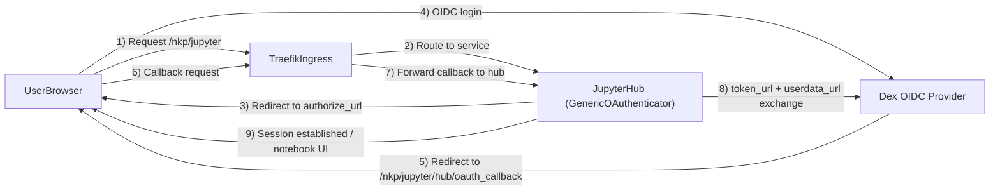
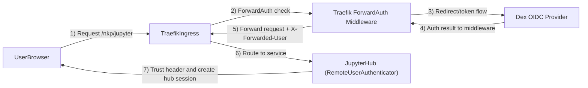

# jupyterhub

JupyterHub brings the power of notebooks to groups of users. It gives users access to computational environments and resources without burdening the users with installation and maintenance tasks.

## Authentication

JupyterHub uses direct Dex/OIDC authentication. JupyterHub redirects users to Dex, exchanges the authorization code for tokens, and creates the JupyterHub session from OIDC user info.

### Dex OIDC prerequisites

Create a dedicated Dex OIDC client for JupyterHub and configure these values through **Workspace Configuration**:

- `hub.config.GenericOAuthenticator.client_id`
- `hub.config.GenericOAuthenticator.client_secret`
- `hub.config.GenericOAuthenticator.oauth_callback_url`
- `hub.config.GenericOAuthenticator.authorize_url`
- `hub.config.GenericOAuthenticator.token_url`
- `hub.config.GenericOAuthenticator.userdata_url`

The callback URL must be:

`https://<jupyterhub-host>/nkp/jupyter/hub/oauth_callback`

Recommended scopes and identity mapping:

- Request OIDC scopes that include user identity (for example `openid`, `profile`, `email`).
- Set `username_claim` to match what Dex returns in your environment (`preferred_username` or `email`).

### Optional dual-gate model (not recommended)

If you keep Traefik Forward Auth middleware in front of JupyterHub while also using direct OIDC, you can hit redirect loops or repeated login prompts. Keep this only when explicitly required by your platform policy and validate redirect behavior carefully.

### Admin Users

By default, no users have admin privileges. To grant admin access, add usernames to the `admin_users` list via **Workspace Configuration**:

```yaml
hub:
  config:
    Authenticator:
      admin_users:
        - alice@company.com
        - bob@company.com
```

Usernames must match exactly what Dex returns (typically email addresses).

### Rollback

To roll back to the previous model, restore the prior `remoteuser` authenticator block and Traefik forward-auth middleware annotation in `4.3.2/helmrelease/cm.yaml`.

## Direct Dex/OIDC Implementation Notes

This catalog entry now uses direct OIDC in JupyterHub (instead of trusting `X-Forwarded-User` from Traefik Forward Auth).

## Detailed Comparison: Header-Based Auth vs Direct Dex/OIDC

This section compares the previous implementation (`remoteuser` + Traefik Forward Auth header trust) and the current implementation (`generic-oauth` + direct Dex/OIDC in JupyterHub).

### At a glance

| Area | Previous: `remoteuser` + `X-Forwarded-User` | Current: `generic-oauth` + Dex OIDC |
|---|---|---|
| Where auth happens | Upstream (Traefik Forward Auth) | In JupyterHub (OIDC client flow) |
| Hub identity source | Trusted HTTP header | OIDC code/token/userinfo exchange |
| Custom code | Required (`remoteuser.py`) | Not required (chart config only) |
| Secret handling | Mostly at ingress/SSO layer | App requires OIDC client credentials |
| Failure visibility | Split across ingress + hub | Mostly visible in hub auth flow/logs |
| Extensibility | Limited claim/policy control in hub | Strong claim/policy control in hub |
| Redirect loop risk | Low in single-gate header mode | Low in direct mode; high if dual-gated |

### Flow differences

- **Previous model (header-based)**:
  1. User hits ingress.
  2. Traefik Forward Auth enforces SSO.
  3. Request reaches JupyterHub with `X-Forwarded-User`.
  4. Custom `RemoteUserAuthenticator` logs user in.

- **Current model (direct OIDC)**:
  1. User hits `/nkp/jupyter`.
  2. JupyterHub redirects user to Dex (`authorize_url`).
  3. Dex authenticates and redirects to Hub callback.
  4. Hub exchanges code at `token_url`, fetches profile from `userdata_url`.
  5. Hub maps identity (`username_claim`) and starts session.

### Current implementation diagram (direct Dex/OIDC)



### Previous implementation diagram (ForwardAuth + header trust)



### Tradeoffs

- **Previous model strengths**
  - Centralized SSO enforcement at ingress.
  - Minimal OIDC config inside JupyterHub.
- **Previous model limitations**
  - Tight trust-boundary coupling to header integrity.
  - More implicit behavior and cross-component debugging.
  - Requires custom authenticator code maintenance.

- **Current model strengths**
  - Standards-based OAuth/OIDC flow owned by JupyterHub.
  - Clearer auth observability and easier provider portability.
  - Richer per-app identity control (`username_claim`, authenticator policy).
- **Current model limitations**
  - Requires proper OIDC client registration and secret management.
  - Misconfigured callback/endpoints break login quickly.

### Extensibility implications

- **Previous model** is best when all auth policy must stay at platform ingress and app-level identity behavior is simple.
- **Current model** is better when teams need app-specific claim mapping, admin policy evolution, provider-specific tuning, or future multi-provider flexibility.

### What changed

- `4.3.2/helmrelease/cm.yaml`
  - `hub.config.JupyterHub.authenticator_class` switched from `remoteuser` to `generic-oauth`.
  - Removed `hub.extraConfig.remoteuser.py` custom authenticator.
  - Added `hub.config.GenericOAuthenticator` keys for Dex OIDC.
  - Removed ingress middleware annotation `traefik.ingress.kubernetes.io/router.middlewares` to avoid dual-gate redirect loops.
- `4.3.2/metadata.yaml`
  - Updated overview/auth text to reflect native Dex/OIDC flow.
- `README.md`
  - Added prerequisites, samples, validation, and test guidance.

### How the login flow works

1. User opens `/nkp/jupyter`.
2. JupyterHub redirects to Dex authorization endpoint (`authorize_url`).
3. Dex authenticates user and redirects to `/nkp/jupyter/hub/oauth_callback`.
4. JupyterHub exchanges authorization code at Dex token endpoint (`token_url`).
5. JupyterHub fetches user profile (`userdata_url`) and creates session.
6. User is redirected to Hub home and can spawn notebook servers.

## How To Use (Operator Steps)

1. Create/register a Dex OIDC client for JupyterHub.
2. Register callback URL:
   - `https://<jupyterhub-host>/nkp/jupyter/hub/oauth_callback`
3. Configure Workspace values (shown below).
4. Deploy/upgrade JupyterHub app from NKP catalog.
5. Validate login and notebook spawn with a non-admin user.
6. Validate admin panel access with at least one admin user.

## Dex Configuration Guide

Use this section when wiring the current catalog defaults to a real Dex deployment.

### 1) Dex client registration requirements

Register a **confidential OIDC client** in Dex for JupyterHub with:

- Redirect URI: `https://<jupyterhub-host>/nkp/jupyter/hub/oauth_callback`
- Grant/response type compatible with authorization code flow
- Scopes sufficient for user identity (typically `openid`, `profile`, `email`)

### 2) Required Workspace Configuration keys

Set all of these (the catalog defaults intentionally leave them blank):

- `hub.config.GenericOAuthenticator.client_id`
- `hub.config.GenericOAuthenticator.client_secret`
- `hub.config.GenericOAuthenticator.oauth_callback_url`
- `hub.config.GenericOAuthenticator.authorize_url`
- `hub.config.GenericOAuthenticator.token_url`
- `hub.config.GenericOAuthenticator.userdata_url`

### 3) Recommended baseline sample

```yaml
hub:
  config:
    GenericOAuthenticator:
      client_id: "<dex-client-id>"
      client_secret: "<dex-client-secret>"
      oauth_callback_url: "https://<jupyterhub-host>/nkp/jupyter/hub/oauth_callback"
      authorize_url: "https://<dex-host>/dex/auth"
      token_url: "https://<dex-host>/dex/token"
      userdata_url: "https://<dex-host>/dex/userinfo"
      login_service: "Dex"
      username_claim: "preferred_username"
      allow_all: true
    Authenticator:
      admin_users:
        - "admin1@company.com"
        - "admin2@company.com"
```

### 4) Claim mapping choice

- Use `username_claim: preferred_username` when Dex emits stable usernames.
- Use `username_claim: email` when email is the canonical identity key.
- Ensure `admin_users` values exactly match the selected claim values.

### 5) Common misconfigurations

- Callback mismatch (`oauth_callback_url` not identical to registered redirect URI).
- Incorrect endpoint paths for Dex (`/dex/auth`, `/dex/token`, `/dex/userinfo`).
- Wrong `username_claim`, causing successful auth but failed user/admin mapping.
- Reintroducing forward-auth middleware while direct OIDC is enabled, causing redirect loops.

### Sample Workspace Configuration (direct Dex/OIDC)

```yaml
hub:
  config:
    GenericOAuthenticator:
      client_id: "<dex-client-id>"
      client_secret: "<dex-client-secret>"
      oauth_callback_url: "https://<jupyterhub-host>/nkp/jupyter/hub/oauth_callback"
      authorize_url: "https://<dex-host>/dex/auth"
      token_url: "https://<dex-host>/dex/token"
      userdata_url: "https://<dex-host>/dex/userinfo"
      login_service: "Dex"
      username_claim: "preferred_username"
      allow_all: true
    Authenticator:
      admin_users:
        - "admin1@company.com"
        - "admin2@company.com"
```

### Sample alternative for email-based identities

If Dex returns email as the stable identifier, use:

```yaml
hub:
  config:
    GenericOAuthenticator:
      username_claim: "email"
```

## Validation And Test Checklist

### Static checks

- Run: `nkp validate catalog-repository --repo-dir=.`
- Run: `devbox run -- just pre-commit`
  - Note: branch-protection hooks may fail on restricted branches (`no-commit-to-branch`) even when manifest/content checks pass.

### Functional checks after deploy

- Unauthenticated request to `/nkp/jupyter` redirects to Dex.
- Successful Dex login returns to `/nkp/jupyter` with no redirect loop.
- Standard user can start a notebook server.
- Admin users configured in `admin_users` can open `/nkp/jupyter/hub/admin`.
- Logout and re-login work consistently.

### Negative tests

- Invalid `client_secret` -> auth fails in Hub logs during token exchange.
- Invalid `oauth_callback_url` -> provider callback/redirect mismatch.
- Wrong `username_claim` -> users may authenticate but fail authorization or admin mapping.

## Review Guide (for maintainers)

- Confirm no credentials are committed in repository defaults (`client_secret` should remain placeholder/override value).
- Confirm ingress still has TLS annotation and class settings.
- Confirm forward-auth middleware annotation is absent for direct OIDC model.
- Confirm `hub.baseUrl` remains `/nkp/jupyter` and callback path matches.

**What admins can do:**

- Access the Admin panel (`/nkp/jupyter/hub/admin`)
- Start/stop other users' servers
- Add/remove users
- Access other users' notebooks (if configured)

## Chart Source

The JupyterHub Helm chart is hosted in a **traditional Helm repository**, not an
OCI registry. It must be pulled locally and pushed to your OCI registry before
the NKP catalog can use it.

Source metadata is stored in `.catalog-source.yaml`:

```yaml
helmrepo: jupyterhub/jupyterhub
helmrepoUrl: https://hub.jupyter.org/helm-chart/
ocipush: oci://ghcr.io/nutanix-cloud-native/charts/jupyterhub
```

### How to push the chart to your OCI registry

```bash
# 1. Add the upstream Helm repository
helm repo add jupyterhub https://hub.jupyter.org/helm-chart/
helm repo update

# 2. Pull the chart version used by this catalog entry
helm pull jupyterhub/jupyterhub --version 4.3.2

# 3. Push to your OCI registry
helm push jupyterhub-4.3.2.tgz oci://ghcr.io/nutanix-cloud-native/charts
```

After pushing, update the OCI URL in `helmrelease/helmrelease.yaml` and
`.catalog-source.yaml` to match your registry.

## Icon

The `icon` field in `metadata.yaml` is a base64-encoded SVG. It was generated
from the jupyterhub icon in wikimedia.org:

| Field | Value |
|-------|-------|
| Source URL | `https://upload.wikimedia.org/wikipedia/commons/3/38/Jupyter_logo.svg` |
| Format | SVG (base64-encoded) |

To regenerate:

```bash
curl -sL https://upload.wikimedia.org/wikipedia/commons/3/38/Jupyter_logo.svg | base64 | tr -d '\n'
```

## Links

- [jupyterhub.io](https://jupyterhub.io)
- [GitHub (jupyterhub)](https://github.com/jupyterhub/jupyterhub)
- [GitHub (Helm chart)](https://hub.jupyter.org/helm-chart/)
