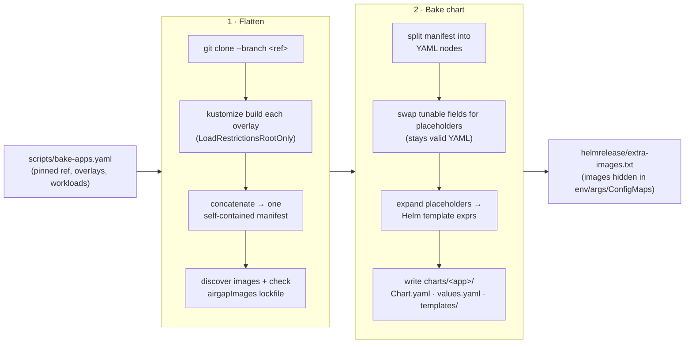

# bake — render Kustomize-only apps into configurable Helm charts

`bake` turns an upstream **Kustomize** application into two things the catalog
needs but the upstream project doesn't provide:

1. a single **self-contained manifest** with no remote or `../` bases, so the app
   can be deployed in air-gapped installs, and
2. a small **parameterized Helm chart** generated from the *same pinned upstream
   ref*, so the app gets a `configOverrides` surface.

Both are produced deterministically from `scripts/bake-apps.yaml`, and a drift
check (`just bake-check`) keeps the committed artifacts honest.

## When to use it

Reach for `bake` only when an app **has no usable upstream Helm chart** and ships
as a Kustomize tree — typically one that:

- pulls in **remote bases** or uses `../` **parent-path** references that Flux's
  load-restrictor rejects in air-gapped installs, and/or
- hides image references in `env`, `args`, or `ConfigMap` values (not just
  `image:` fields), so the air-gap bundler would otherwise miss them.

Kubeflow components (Pipelines, Central Dashboard, Katib, …) are the motivating
example. If an app already publishes a clean Helm chart, **don't bake it** — add
it the normal way (`OCIRepository` + `HelmRelease`, see the repo
[README](../../README.md#adding-a-new-application)).

### Why a chart at all?

NKP only lets customers tune a published app through
`AppDeployment.spec.configOverrides`, which requires a **HelmRelease**. A flat
baked manifest has no knobs. So `bake` also emits a Helm chart that exposes an
allowlist of workload fields (replicas / resources / scheduling) while keeping
everything else byte-for-byte identical to the flattened upstream.

## How it works

`bake` runs two stages per app+version. It shells out to `git` (clone the pinned
ref), `kustomize` (render overlays), and — only with `--mirror-images` — `crane`.



**1 · Flatten.** Clone the pinned upstream ref, `kustomize build` each overlay
with `LoadRestrictionsRootOnly`, and concatenate the output into one flat
manifest with no remote or `../` bases. Discover every image — both `image:`
fields and registry-qualified refs buried in `env`/`args`/`ConfigMap` values —
and check them against the declared `airgapImages` lockfile. Refs that live only
outside `image:` fields are written to `helmrelease/extra-images.txt` so the
air-gap bundler still mirrors them.

**2 · Bake chart.** Parse the flat manifest as a YAML node tree (so key order,
comments, and everything untouched are preserved byte-for-byte). For each
workload named in the config, replace its tunable fields with placeholders, then
expand those into Helm expressions. The generated `values.yaml` is seeded from
the upstream defaults, so an untouched chart renders identically to the flattened
manifest.

### Templating (before & after)

**Before** — hardcoded Kustomize output:

```yaml
spec:
  replicas: 2
  template:
    spec:
      containers:
        - resources:
            requests:
              cpu: 100m
```

**After** — baked Helm template:

```yaml
spec:
  # scalars → inline default seeded from upstream
  replicas: {{ .Values.workloads.myWorkload.replicas | default 2 }}
  template:
    spec:
      containers:
        # blocks → wrapped so a whole subtree can be overridden
        {{- with .Values.workloads.myWorkload.resources }}
        - resources:
            {{- toYaml . | nindent 12 }}
        {{- end }}
```

## Configuration

Apps to bake are declared in [`scripts/bake-apps.yaml`](../../scripts/bake-apps.yaml).
The schema is the `Config` / `App` / `Version` / `Chart` types in
[`config.go`](./config.go) — the field comments there are the source of truth.
Key fields:

| Field | Purpose |
|-------|---------|
| `repo` / `versions[].ref` | upstream git repo and the **pinned** tag or commit to render |
| `versions[].overlays` | kustomize overlay paths to build, in order |
| `versions[].airgapImages` | images referenced only outside `image:` fields (lockfile) |
| `versions[].chart.workloads` | workloads whose replicas/resources/scheduling become tunable values |
| `versions[].chart.overlay` | rare hand-authored additions layered onto the generated chart deterministically |

## Usage

Run from the repo root (recipes live in the [`justfile`](../../justfile)):

```bash
just bake <app> [version]     # render + bake into applications/<app>/ and charts/<app>/
just bake-check               # re-bake everything; fail if committed artifacts drifted (CI gate)
just bake-build               # compile-check the tool
just bake-test                # vet + unit tests
```

Or invoke the Go module directly for finer control:

```bash
go -C tools/bake run . --app kubeflow-pipelines                 # all versions
go -C tools/bake run . --app kubeflow-pipelines --version 2.15.0
go -C tools/bake run . --app kubeflow-pipelines --render-only   # flatten only, skip chart
go -C tools/bake run . --all                                    # every configured app
go -C tools/bake run . --app kubeflow-pipelines --version 2.15.0 \
  --registry ghcr.io/nutanix-cloud-native --mirror-images       # also mirror images
```

`bake-check` runs in CI (`.github/workflows/manifest.yml`), so a stale
committed chart or manifest fails the build.

## Layout

| File | Responsibility |
|------|----------------|
| `main.go` | CLI, config load, per-version pipeline orchestration |
| `config.go` | `bake-apps.yaml` schema |
| `render.go` | clone upstream + `kustomize build` overlays |
| `airgap.go` | image discovery + `airgapImages` lockfile check |
| `package.go` | flatten/rewrite manifest, write `extra-images.txt` |
| `nodes.go` | YAML node-tree helpers (preserve order/comments) |
| `parameterize.go` | swap tunable fields → placeholders → Helm expressions |
| `bake.go` | assemble `Chart.yaml` / `values.yaml` / `templates/` |
| `exec.go`, `util.go` | shell-out and small helpers |
